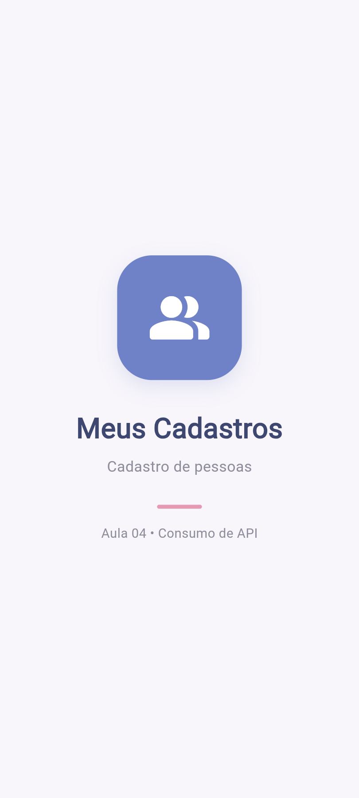
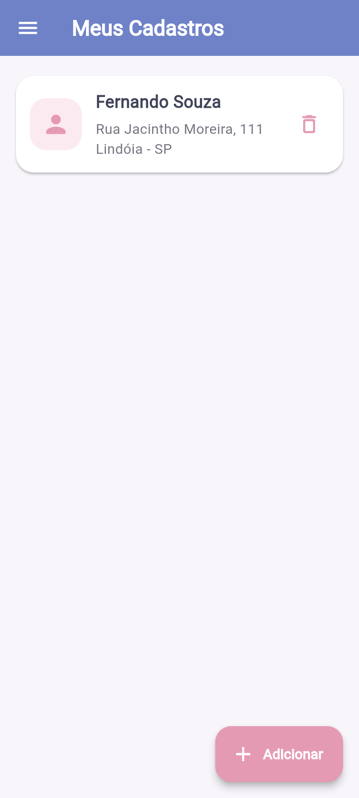
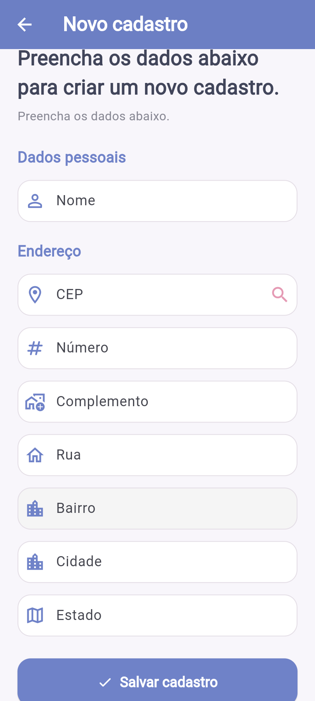

# Aula 04 - ViaCEP

O aplicativo é um cadastro de pessoas que utiliza a API ViaCEP para buscar os dados do endereço através do CEP.

## O que o aplicativo faz

* Tela Splash
* Tela inicial com as pessoas cadastradas
* Menu lateral
* Cadastro de pessoa
* Consulta de CEP pela ViaCEP
* Preenchimento automático de rua, bairro, cidade e estado
* Salva os cadastros no celular
* Permite excluir um cadastro

## API usada

ViaCEP: https://viacep.com.br/

## Tecnologias

* Flutter
* Dart
* ViaCEP
* SharedPreferences
* Google Fonts

## Como executar

No terminal:

```bash
flutter pub get
flutter run
```

Também pode ser executado pelo Chrome:

```bash
flutter run -d chrome
```

## Prints

### Splash



### Home



### Cadastro com consulta do CEP



